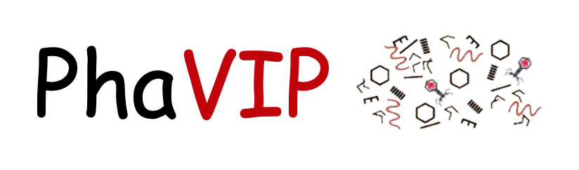

PhaVIP is a python library for phage protein annotation.  It has two functions. First, it can classify a protein into either phage virion protein (PVPs) or non-PVPs (binary classification task). Second, it can assign a more detailed annotation for predicted PVPs, such as major capsid, major tail, and portal (multi-class classification task).


PhaVIP is based on chaos game representation and Vision Transformer model. This GitHub is the local version of PhaVIP. The webserver of PhaVIP is avaliable via [server version](https://phage.ee.cityu.edu.hk/phavip). 

In addition, we provide many other phage-related analysis tools, such as [phage identification](https://github.com/KennthShang/PhaMer), [taxonomy classification](https://github.com/KennthShang/PhaGCN), [lifestyle prediction](https://github.com/KennthShang/PhaTYP), and [host prediction](https://github.com/KennthShang/CHERRY). Feel free to check them out on our website [PhaBOX](https://phage.ee.cityu.edu.hk/). 

# Overview


## Required Dependencies
Detailed package information can be found in `phavip.yaml`

If you want to use the gpu to accelerate the program please install the packages below:
* cuda
* Pytorch-gpu

Search [pytorch](https://pytorch.org/) to find the correct cuda version based on your computer.


## Quick install
*Note*: we suggest you to install all the package using conda (both [miniconda](https://docs.conda.io/en/latest/miniconda.html) and [Anaconda](https://anaconda.org/) are ok).

After cloning this respository, you can use anaconda to install the **phavip.yml**. This will install all packages you need with cpu mode. The command is: `conda env create -f phavip.yml -n phavip`

Once installed, you only need to activate your 'phavip' environment before using phavip in the next time.
```
conda activate phabox
```

## Usage 

### Run all pipelines in one command:

```
python run_PhaVIP.py [--filein INPUT_FA] [--threads NUM_THREAD] [--type IN_TYPE] [--task TASK] [--tool TOOL_PTH] [--root ROOT_PTH] [--mid MID_PTH] [--out OUTPUT_PTH] 
```


**Options**


      --filein INPUT_FA
                            The path of your input fasta file.
      --threads NUM_THREAD
                            Number of threads to run PhaMer (default 8)
      --type IN_TYPE
                            Input type of the fasta: protein or dna (default protein)  
      --task TASK
                            Task: binary or multi (default binary)  
      --tool TOOL_PTH
                            The folder where you downlod PhaVIP (default PhaVIP/)
      --root ROOT_PTH
                            The folder you want to store the outputs of PhaVIP (default user_0/)
      --out OUTPUT_PTH
                            The output folder under root. All the prediction will be stored in this folder. (default out/)
      --mid MID_PTH
                            The midfolder under root. All the intermediate files will be stored in this folder. (default midfolder/)


**Example**


Prediction on the example dna file under PhaVIP folder:

    python run_PhaVIP.py --filein test_contigs.fa --threads 8 --type dna --task binary --tool ./ --root sample_test/ --mid midfolder/ --out out/

OR protein file:

    python run_PhaVIP.py --filein test_protein.fa --threads 8 --type protein --task binary --tool ./ --root sample_test/ --mid midfolder/ --out out/
    
Prediction on your data file out of PhaVIP folder:

    python run_PhaVIP.py --filein PATH/TO/FASTA/test_contigs.fa --threads 8 --type dna --task binary --tool PATH/TO/PhaVIP --root ~/user_0/ --mid midfolder/ --out out/
    
### References

ArXiv version: Shang, J., Peng, C., Tang, X., & Sun, Y. (2023). PhaVIP: Phage VIrion Protein classification based on chaos game representation and Vision Transformer. arXiv preprint arXiv:2301.12422.
ArXiv Link: [paper](https://arxiv.org/pdf/2301.12422.pdf)

### Contact
If you have any questions, please email us: jyshang2-c@my.cityu.edu.hk


